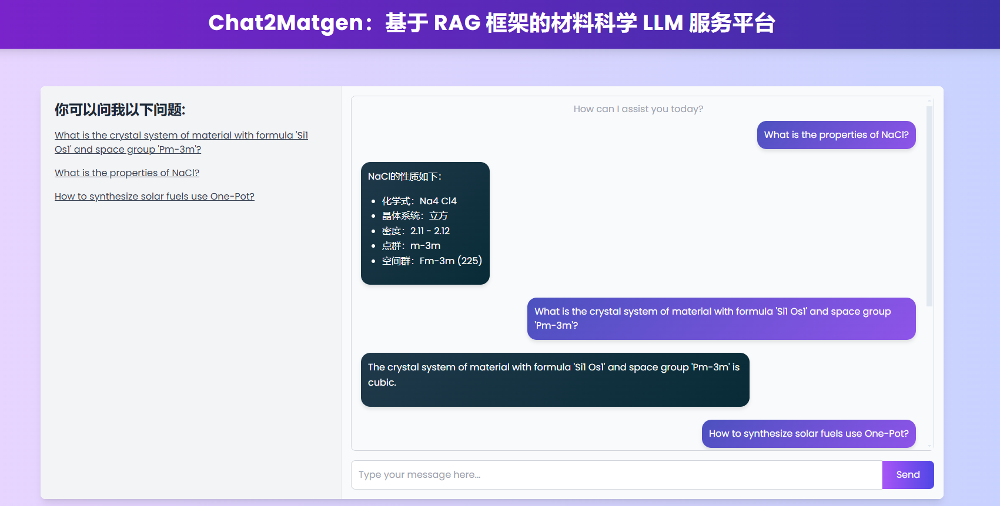

## 安装步骤
**最便捷的体验（LLM + Matgen API)**
```
git clone https://github.com/qiulanzhu/Chat2Matgen.git
cd Chat2Matgen
pip install -r requirements.txt
在目录api/openapi_api.py中配置大模型的api_key和base_url
python app.py
打开浏览器，访问 http://localhost:8200/
```

**完整体验（LLM + Matgen API/论文库）**
* 1.搭建知识库，使用QAnything的存储和检索功能（https://github.com/netease-youdao/QAnything）

* 2.导入论文

* 3.准备大模型的对话接口（二选一）
    - 3.1 使用商业api接口，如deepseek、智谱等
    - 3.2 使用本地部署的api接口，采用ollama部署

* 4.启动项目

## 页面效果
